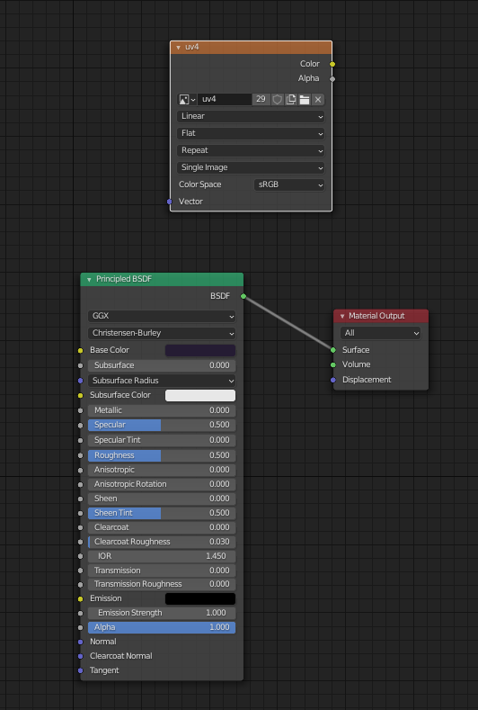
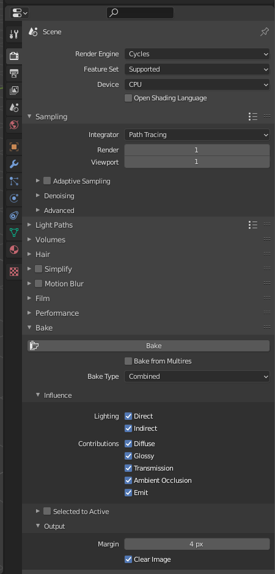
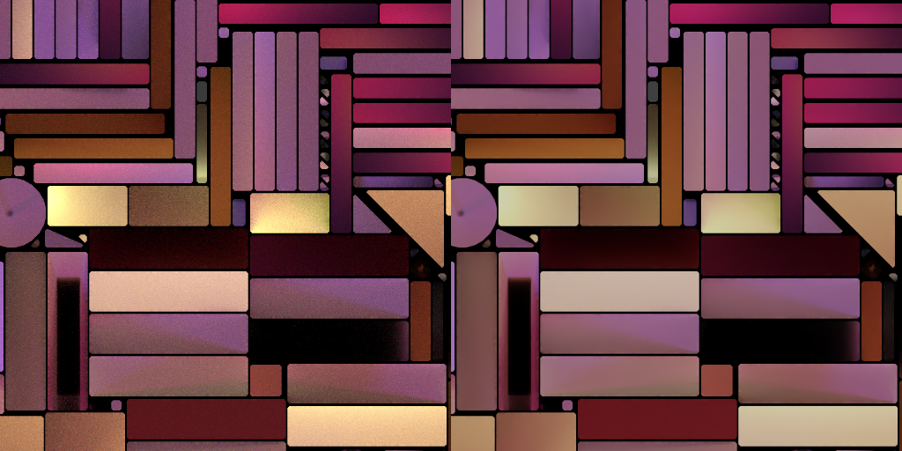
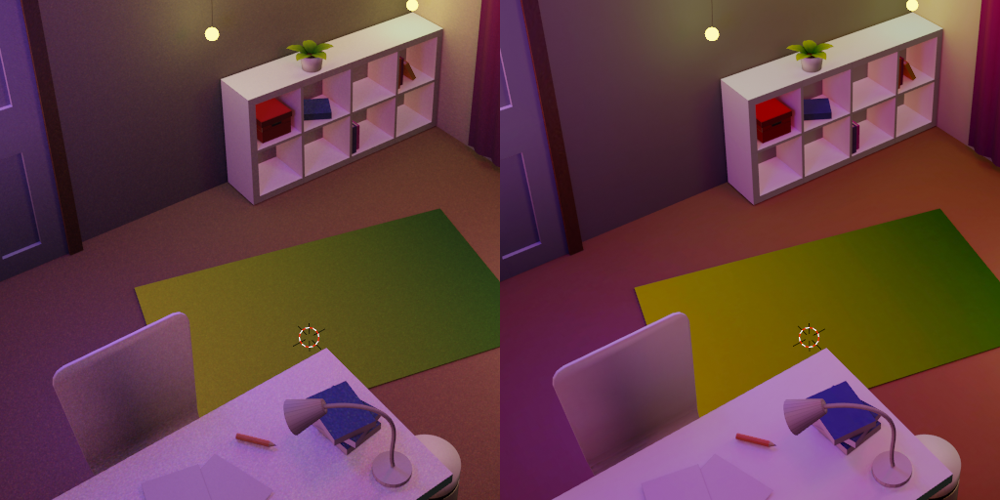
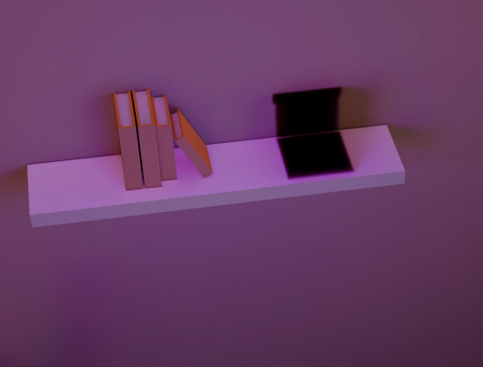

# Baked lighting in r3f

Recently a [tweet](https://twitter.com/arturitu/status/1348167088628760576) from [@arturitu](https://twitter.com/arturitu) inspired me to try light baking for making beautiful Three.js scenes and here's a walkthrough of problems I found on my way there.

[CodeSandbox](https://codesandbox.io/s/baked-l3jtj) · [Twitter thread](https://twitter.com/tchayen/status/1351174072823140355)


## Model preparation

Workflow was similar to how I would approach regular mid-poly scene. I didn't want to fall into low poly style, but also made sure that circular shapes like lamps won't get too heavy.


### Texturing
I started with solid colors, but later enhanced it with a technique called [Lazy Unwrapping](https://www.youtube.com/watch?v=DD84GSJiTVc). It's basically all about finding out what group of vertices should have one end of the gradient and what the other.


I used it to achieve interesting effects on larger surfaces like curtains and carpet. They are also present on table legs and bin tray, but now I think that relying on cycles lighting would be sufficient.


### Curtains

I used `Wave` modifier as described in the [How to model realistic curtains in Blender](https://www.youtube.com/watch?v=lHIBQBSdfjA) tutorial.

### Making walls disappear when rotating

For this I used the oldest and simplest trick we got for it – backface culling. I enabled it for the wall material (it turned out sufficient for the viewing while enabling it for other shapes made them look very weird from behind).

glTF and Three.js support it well, so I didn't have to worry about it during later steps.

### Curves

Using paths was important for achieving precision in some parts of the model. I used similar technique to presented in [Pivot Desk Lamp](https://www.youtube.com/watch?v=q5lmw_T8Ep4) to achieve the lamp arm.

Placing lamps along the path was trickier than just using the `Curve` modifier as it would deform them. What did the trick was using instancing to place several planes along the curve and then use a mesh to place in their place while hiding them. It is well described in this [tutorial](https://www.youtube.com/watch?v=7pXcyq0gUnU).

## Concerns and glTF preparations

It took me some painful trial and error when moving from having a model to having a setup that allows light baking.

I have no idea whether those steps are fully needed, but what I found particulary useful in the process was:
1. Unlinking all linked objects and making them their own meshes.
2. Materializing curves (like lamp arm or decoration light cables).
3. Fixing normals. Blender is really forgiving in the object or even material mode about normals that go in wrong direction. Baking is not like that in any way. Broken objects were easy to identify as they turned out black or mostly black in the rendered texture.
4. I divided my scene into two collections: _Lights/emmision meshes_ and _meshes_.
5. I went through all objects to apply scale and rotation.

What was very handy was this [tip how to turn instances to meshes](https://devtalk.blender.org/t/elegant-way-to-turn-a-collection-instance-to-a-mesh/8803/11) which helped me with the instanced lamps.

## Baking light

Baking light is possible using `Cycles` engine. The idea is to capture ray traced light in the textures and use them later to achieve amazing offline-quality lighting with the cost of rendering just the textured meshes (which is much less demanding on GPU).

Some people like to keep different diffuse (the colors) and lightmap (how different surfaces are lit) textures, but I used the `Combined` setting and included everything in one. It also allowed me to remove all materials as they served no purpose after baking.

### UVs

In order to do the baking, I set each material's UV maps in the following way (default one is rendered, a new, `Bake`, is selected):


This was very tedious and repetitive work to go through all objects like this and I am looking forward to automating it with some plugin in the future.

### Shaders

Create a new image (for example in the UV editor mode) of size `4096x4096` with no alpha.
In shader editor add a new `Image Texture` pointing to that image. Apply for each material. Make sure that the texture node is active by pressing it (white border).



Select all relevant meshes (I use a helper collection for this as in 4. in the list above), go to edit mode, unwrap the mesh.

I used [UVPackmaster 2](https://gumroad.com/l/uvpackmaster2) for extra quality of the UV map packing but that should not be necessary.

### Test run

Most important tip for saving time and avoiding frustration I can give based on my experience is to do a test run of the baking. This is a very wild and unintuitive (at least in the beginning) procedure and sometimes required unexplained restarts of Blender for some things to start working.

Also test run is the place to find out about all issues in the meshes and the moment when incorrect normals show up as black texture parts.

I suggest going for the lowest quality of 1 sample and maybe even smaller image like `512x512` to first try how it looks like.



You can also try increasing the sampling rate a bit (for example to 10) to evaluate quality of textures on different objects. I experienced poor quality of floor and some object like bin tray or chair. I mitigated it by scaling up their UV faces and recalculating UV pack.

Image below shows not only noise but also very inconsistent resolution that was calculated for different meshes by the UV unwrapping.


I also managed to reclaim some texture space by scaling down shapes invisible to viewer like bottom side of the table, chair or floor.

### Final image and postprocessing

For the final lightmap I used `4096x4096` texture with `4px` margins (that value seems too low now as there is noticeable bleeding of black background on door handle, desk lamp arm and bookcase) and 128 samples.

Invaluable help came from this [denoising trick](https://www.youtube.com/watch?v=lJbGR0Jnd0k) that drastically improved quality of the texture. It came with a cost of calmer and colder lights that I mitigated by postprocessing the texture in GIMP. In future I will try to stick to Blender node compositor to make it replicable.



This is how the whole scene looks with freshly baked texture vs how it looks after denoising and some color grading postprocessing.



## Three.js setup

For moving the scene to Three.js I used `npx gltfjsx` command to generate a `react-three-fiber` scene definition. Then I did basic canvas setup:

```jsx
<Canvas concurrent pixelRatio={[1, 2]} camera={{ position: [0, 4, 4] }}>
  <Stats />
  <ambientLight />
  <OrbitControls enableZoom={false} />
  <Suspense
    fallback={
      <Html>
        <div>Loading...</div>
      </Html>
    }
  >
    <Scene />
  </Suspense>
</Canvas>
```

When exporting `*.glb` file, I had to stick to the default `Principled BSDF` node with texture applied and then I had to make sure I am not exporting vertex colors. Otherwise material configuration would lead to black mesh instead of the expected texture.

### Outline on hover

_I will update it here once I get good enough performance on it. WIP._

## Conclusion

The effect is surprisingly powerful. Baked lighting creates amazing and mostly lightweight to render scenes. In the end I am able to join all meshes in the scene into one (I am not doing it for the hover effects that I am exploring though).

This technique comes with some limitations. In my case no object can move because the shadow it casts is baked into textures of surrounding objects. As you can see, the red box on the shelf must stay there forever:



Is it a bad thing though? Absolutely not! I didn't plan to move any of my objects so this is perfectly fine for me and the added quality comes with no disadvantages. But it should be considered that it's not always the case.

## Next steps

Even though this scene will remain mostly static, it doesn't mean there's no way to go from here. I started with adding hover outline effect (as seen in the first screenshot) and I am currently working on optimizing that.

From there it can go either in direction of some interactive storytelling/RPG game or become a furniture shop website (IKEA experience of the future). In that case AR might come in handy to allow user to try out a carpet in their own room. And in both cases VR will be a nice addition.

If you enjoyed reading it and would like to see more similar content in the future – you can follow me on [Twitter](https://twitter.com/tchayen)!